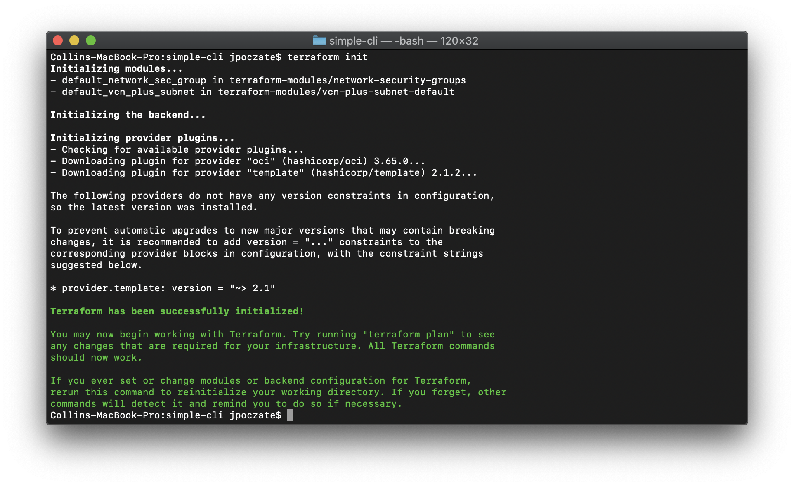

# oci-uipath
This is a Terraform module that deploys [UiPath](https://www.uipath.com/) on [Oracle Cloud Infrastructure (OCI)](https://cloud.oracle.com/en_US/cloud-infrastructure).  It is developed jointly by Oracle and UiPath and can deploy either UiPath [Robots](https://www.uipath.com/product/robots) or [Orchestrator](https://www.uipath.com/product/orchestrator).

## Prerequisites
First off you'll need to do some pre deploy setup.  That's all detailed [here](https://github.com/oracle/oci-quickstart-prerequisites).

## Clone the Module
You'll first want a local copy of this repo by running:

```
git clone https://github.com/oracle-quickstart/oci-uipath.git
cd oci-uipath/
ls
```
That should give you this:


We now need to initialize the directory with the module in it.  This makes the module aware of the OCI provider.  You can do this by running:

```
terraform init
```
This gives the following output:



## Deploy

First we want to run `terraform plan`. This runs through the terraform and lists
out the resources to be created based on the values in `variables.tf`. If the
variable doesn't have a default you'll be promted for a value.

If that's good, we can go ahead and apply the deploy:

```
terraform apply
```

You'll need to enter `yes` when prompted.  The apply should take several minutes
to run, and the final setup will happen asynchronously after this returns.

Once complete, you'll see something like this:


## Destroy the Deployment
When you no longer need the deployment, you can run this command to destroy it:

```
terraform destroy
```

You'll need to enter `yes` when prompted.  Once complete, you'll see something like this:


### How to base64 encode the your pfx certificate
If your pfx certificate is already installed on your machine you need to export the certificate with the following information:
1. Export the private key
2. Include all certificates in the certification path if possible
3. Enable certificate privacy

If you already have the pfx certificate stored on your machine, run the commands below to convert it to base64 string.

```
$rawPfxCert = get-content '$pathToPfxCertificate' -Encoding Byte
$base64_cert = [System.Convert]::ToBase64String($rawPfxCert)
```

Please provide base64_cert to the deployment !!!